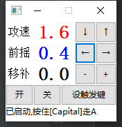

本程序是LOL走A辅助程序，手残又想玩ADC福利，使用模拟按键的方式，所以不用担心封号

本程序前提是基于LOL改键

请进游戏到设置修改:

1. 快捷攻击型移动，选择设置成 Z 键
2. 玩家移动点击，选择设置成 X 键
3. 仅针对目标英雄设置为 C 键
4. 最好把窗口设置为无边框模式或者窗口模式

建议使用前先开一把训练模式试一下:

使用步骤：

1. 打开LOL按住,CapsLock,走A
2. 当购买攻速装备后，需要调整攻速,按↑键提升攻速,按↓降低攻速,一般从屏幕方英雄头像位置可以看到攻速数值

按键说明：

- CapsLock ：按住开始走A

- Esc ： 隐藏软件界面到托盘区

- ↑：呼出软件并提升软件走A攻速
- ↓：呼出软件并降低走A攻速
- ←：呼出软件并减小英雄前摇比例，例如天使可以设置0.25 意思为，假设每次攻击要1秒，其中0.25秒为攻击前摇，剩余为取消后摇后走路时间，这个值越小走A越顺畅，但太小了容易漏A，反之不容易漏A，不同英雄前摇比例不同。
- →：呼出软件并增大前摇比例

- Insert:呼出软件并重新绑定触发走A按键,例如先按下Insert,然后按空格,此时,走A触发键就由CapsLock变成了空格键.
- page up:呼出软件并开始走A触发
- page down:呼出软件并暂停走A触发

下载：https://github.com/miqt/LOLGameTools/releases  
加群搞事情：qq：209622340

> 2021年1月26日 更新自动获取攻速支持 | 感谢 [ztgreenleaves](https://github.com/ztgreenleaves) 提供自动获取攻速的功能！

